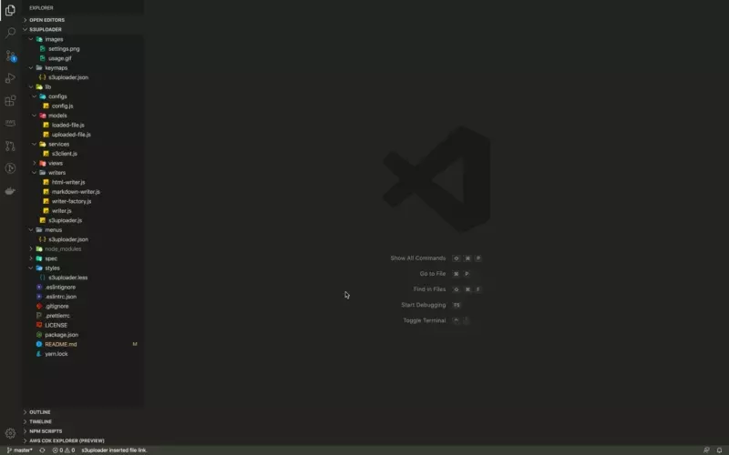
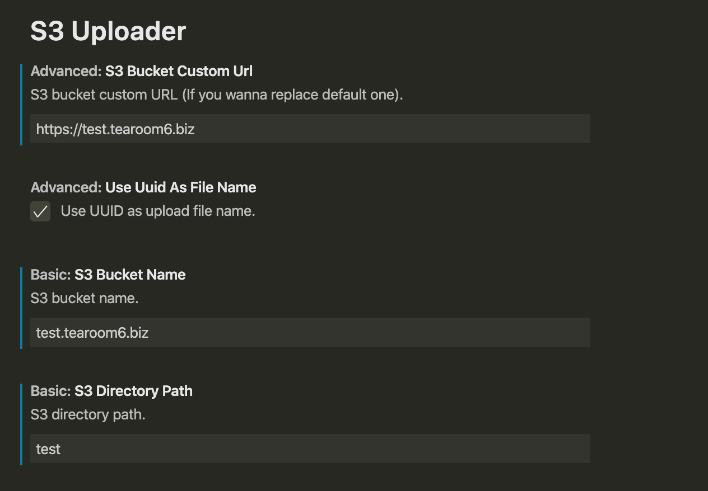

# s3uploader (VSCode)

VSCode Extension; file uploader to Amazon S3 with inserting link.



## Features

- [ ] Upload file by drag & drop.
- [x] Upload file by copy file absolute link & paste.
- [ ] Upload file by copy file relative link & paste.
- [ ] Upload file by copy image file binary & paste.
- [ ] Upload multiple files at once.
- [ ] Support multiple destination AWS account / S3 bucket.
- [ ] Support other storage services.
- [x] Insert Markdown tag (image or link).
- [x] Insert HTML tag (image or link).

## Setup

### AWS configuration

**Create access key:**

1. Sign in to [AWS console](https://console.aws.amazon.com/iam/home) and open IAM dashboard.
2. Open user's [Security credentials] tab.
3. Click [Create access key], and copy access key ID / secret access key.

> References

- [Managing Access Keys for IAM Users - AWS Identity and Access Management](https://docs.aws.amazon.com/IAM/latest/UserGuide/id_credentials_access-keys.html)

**Configure credentials (only show the case of macOS):**

1. Install awscli.

   ```sh
   brew install awscli
   ```

2. Add AWS default configurations.

   ```sh
   aws configure
   ```

> References

- [Configuring the AWS CLI - AWS Command Line Interface](https://docs.aws.amazon.com/cli/latest/userguide/cli-chap-configure.html)

**Create S3 bucket:**

1. Sign in to [AWS console](https://console.aws.amazon.com/iam/home) and open S3 console.
2. Click [Create bucket] and copy bucket name.

## Extension Settings

* `s3uploader-vscode.basic.s3BucketName`: S3 bucket name
* `s3uploader-vscode.basic.s3DirectoryPath`: S3 directory path
* `s3uploader-vscode.advanced.s3BucketCustomUrl`: S3 bucket custom URL (If you wanna replace default one)
* `s3uploader-vscode.advanced.useUuidAsFileName`: Use UUID as upload file name



## Extension Commands

* `s3uploader-vscode.uploadCopiedFileAndPasteLink`: Insert clipboard file link with S3 Uploading (default: ctrl+shift+u)
* `s3uploader-vscode.uploadSelectedFileAndInsertLink`: Insert selected file link with S3 uploading (default: ctrl+alt+u)
